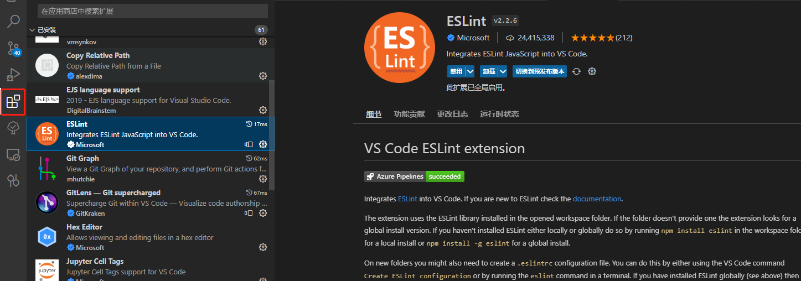

# SoundCloud-Player
This extension is for the soundcloud heavy users.

You can control the tracks without changing your tab. Just open the popup n boom.

[We uploaded a quick tutorial video on YouTube.](https://www.youtube.com/watch?v=hIJyF2u3-RY)

# Disclaimer
If you want to make an issue, Please write it in English or Japanese. Other language will not be supported.

# Links
- [Install this on Chrome](https://chrome.google.com/webstore/detail/soundcloud-player/oackhlcggjandamnkggpfhfjbnecefej)
- [Feedback](https://forms.gle/Cz6z8AgGYkHuSiQSA)
- [Buy me a coffee!](https://ko-fi.com/sawanese)

# Documents
- [Wiki](https://github.com/S4WA/soundcloud-player/wiki)
- [How to Use](https://github.com/S4WA/soundcloud-player/wiki/How-to-Use)
- [CRXcavator Report](https://crxcavator.io/report/oackhlcggjandamnkggpfhfjbnecefej/)

# Images

# Dev
If you use vscode, I recommend you install this plugin, it will auto format code when you save.

After run `npm run dev`, you can see a new folder named **dist** in root directory, drag this folder to browser extension and run it.

`npm run ui` is local server dev mode, it's hard to hot-reload in extension ui dev, so this is a new way to resolve it.
If you are windows, and you have sh tools e.g. cmder, use `npm run ui`. If you don't have, use `npm run ui_o`.
*./buid/webpack.ui.dev.config.js* is ui dev mode config file, you can add new configurations based on this structure, default run with **main** config. If you can use `npm run ui`, then you can run like `npm run ui page2` or `npm run page3`, it will use **page2** or **page3** config to start dev server.